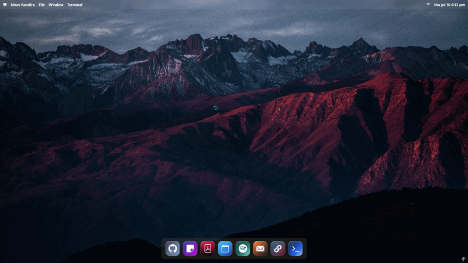
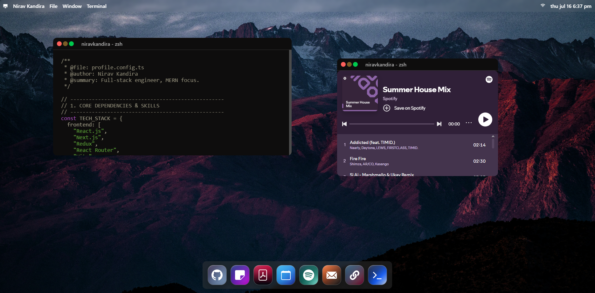

# portFOS

A macOS-inspired interactive portfolio built with React and Vite. portFOS presents projects, profile notes, a resume viewer, Spotify embed, and an interactive terminal inside draggable desktop-style windows.



## Overview

portFOS turns a developer portfolio into a lightweight desktop environment. Visitors can open apps from the dock, move windows around, inspect projects, read profile notes, view the resume, and interact with a custom terminal experience.

## Screenshot



## Features

- macOS-style desktop interface with wallpaper, navbar, dock, and window controls
- Draggable and resizable app windows powered by `react-rnd`
- Project showcase window with responsive cards and project metadata
- Code-styled notes/profile window with syntax highlighting
- Embedded resume PDF viewer
- Spotify playlist embed
- Interactive terminal powered by `react-console-emulator`
- Window close, maximize, and restore behavior
- Vite-powered development workflow with Sass styling

## Tech Stack

- React
- Vite
- Sass / SCSS
- react-rnd
- react-console-emulator
- react-syntax-highlighter

## Getting Started

Clone the repository and install dependencies:

```bash
git clone <your-repo-url>
cd portFOS
npm install
```

Start the development server:

```bash
npm run dev
```

Build for production:

```bash
npm run build
```

Preview the production build:

```bash
npm run preview
```

## Project Structure

```txt
portFOS/
|-- public/
|   |-- dock-icons/
|   |-- navbar-icons/
|   |-- note.txt
|   `-- resume.pdf
|-- src/
|   |-- assets/
|   |   |-- demo.gif
|   |   |-- home.png
|   |   `-- wallpaper2.jpg
|   |-- components/
|   |   |-- windows/
|   |   |-- Dock.jsx
|   |   `-- Navbar.jsx
|   |-- App.jsx
|   `-- main.jsx
|-- package.json
`-- vite.config.js
```

## Customization

- Update project cards in `src/assets/github.json`.
- Update profile/code notes in `public/note.txt`.
- Replace the resume at `public/resume.pdf`.
- Swap wallpapers or screenshots in `src/assets`.
- Adjust default app window positions in the individual window components.

## License

This project is intended as a personal portfolio. Add a license file if you plan to make it open source.
