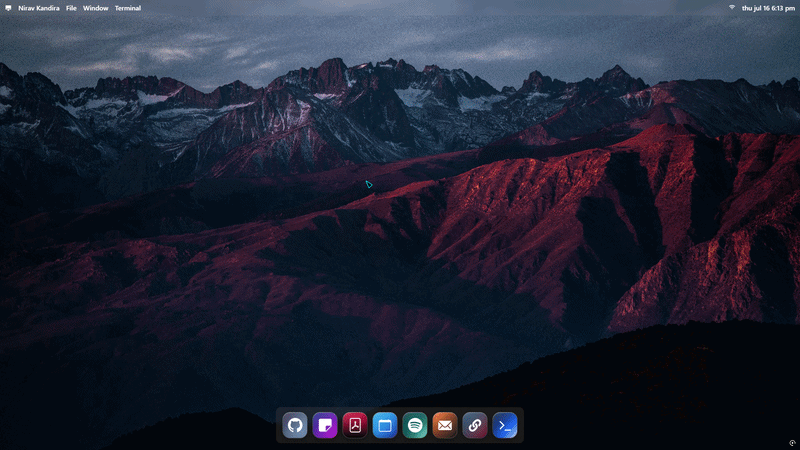
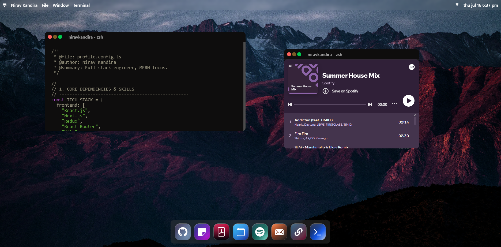

# portFOS

A macOS-inspired interactive portfolio built with React and Vite. portFOS presents projects, profile notes, a resume viewer, Spotify embed, and an interactive terminal inside draggable desktop-style windows.

**Live Demo:** [https://portfos-1.onrender.com](https://portfos-1.onrender.com)



## Overview

portFOS turns a developer portfolio into a lightweight desktop environment. Visitors can open apps from the dock, move windows around, inspect projects, read profile notes, view the resume, and interact with a custom terminal experience. The interface also includes a wallpaper cycling control with a frosted-glass button that lets users switch between multiple desktop backgrounds while preserving the polished macOS-inspired aesthetic.

## Screenshot



## Features

- macOS-style desktop interface with wallpaper, navbar, dock, and window controls
- Wallpaper switcher with frosted-glass button and persisted theme rotation
- Draggable and resizable app windows powered by `react-rnd`
- Project showcase window with responsive cards and project metadata
- Code-styled notes/profile window with syntax highlighting
- Embedded resume PDF viewer
- Spotify playlist embed
- Interactive terminal powered by `react-console-emulator`
- Window close, maximize, and restore behavior
- Vite-powered development workflow with Sass styling

## Tech Stack

- React
- Vite
- Sass / SCSS
- react-rnd
- react-console-emulator
- react-syntax-highlighter

## Getting Started

Clone the repository and install dependencies:

```bash
git clone https://github.com/MELLOxProg/portFOS.git
cd portFOS
npm install
```

Start the development server:

```bash
npm run dev
```

Build for production:

```bash
npm run build
```

Preview the production build:

```bash
npm run preview
```

## Project Structure

```txt
portFOS/
|-- .gitignore
|-- eslint.config.js
|-- index.html
|-- package.json
|-- package-lock.json
|-- vite.config.js
|-- public/
|   |-- dock-icons/
|   |-- navbar-icons/
|   |-- note.txt
|   `-- resume.pdf
|-- src/
|   |-- App.jsx
|   |-- app.scss
|   |-- main.jsx
|   |-- assets/
|   |   |-- demo.gif
|   |   |-- github.json
|   |   |-- home.png
|   |   `-- wallpapers/
|   |       |-- 1.png
|   |       |-- 2.png
|   |       |-- 3.png
|   |       |-- 4.jpg
|   |       |-- 5.png
|   |       |-- 6.webp
|   |       |-- 7.jpg
|   |       `-- 8.jpg
|   `-- components/
|       |-- DateTime.jsx
|       |-- Dock.jsx
|       |-- dock.scss
|       |-- glass.mixin.scss
|       |-- Navbar.jsx
|       |-- navbar.scss
|       `-- windows/
|           |-- Cli.jsx
|           |-- cli.scss
|           |-- Github.jsx
|           |-- github.scss
|           |-- Mwindow.jsx
|           |-- Note.jsx
|           |-- note.scss
|           |-- Resume.jsx
|           |-- resume.scss
|           |-- Spotify.jsx
|           |-- spotify.scss
|           `-- window.scss
`-- dist/
```

## Customization

- Update project cards in `src/assets/github.json`.
- Update profile/code notes in `public/note.txt`.
- Replace the resume at `public/resume.pdf`.
- Swap or add wallpapers in `src/assets/wallpapers/` and update the rotation list in `src/App.jsx`.
- Adjust default app window positions in the individual window components.
- Tune the wallpaper switcher button style in `src/app.scss` if you want a different glass effect or spacing.

## License

This project is intended as a personal portfolio. Add a license file if you plan to make it open source.
